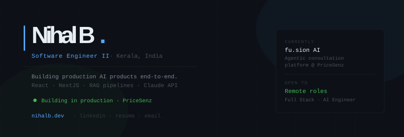

 

&nbsp;
&nbsp;
&nbsp;

---

**Stack**

---

**Projects**

| Project | Description | Stack |
|:---|:---|:---|
| **fu.sion AI** ◉ | Agentic consultation platform — RAG, multi-agent routing, streaming UI | React · NestJS · Milvus · Claude |
| **SoloFlow** | Personal productivity tracker | Next.js · Firebase |
| **[Calendar Clone](https://github.com/nihal-b/Google-Calender)** | Pixel-perfect Google Calendar — React state patterns | React · JS |
| **[nihalb.dev](https://nihalb.dev)** | Portfolio — minimal, dark, fast | Next.js |

---

&nbsp;&nbsp;

  
Kerala, India &nbsp;·&nbsp; open to remote &nbsp;·&nbsp; full stack · ai

